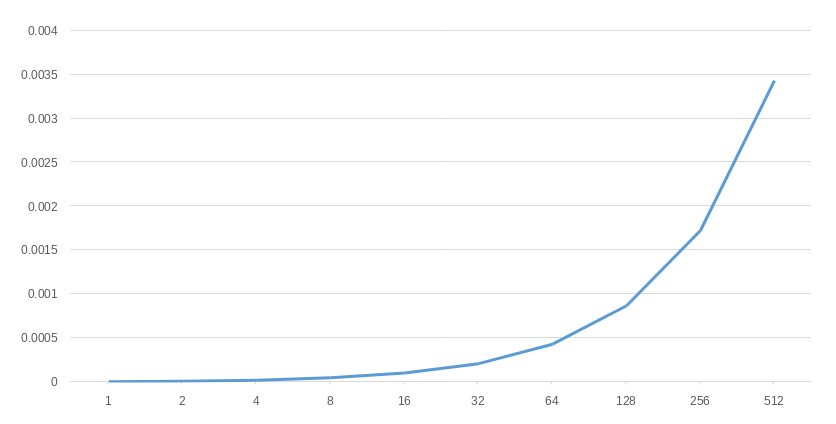
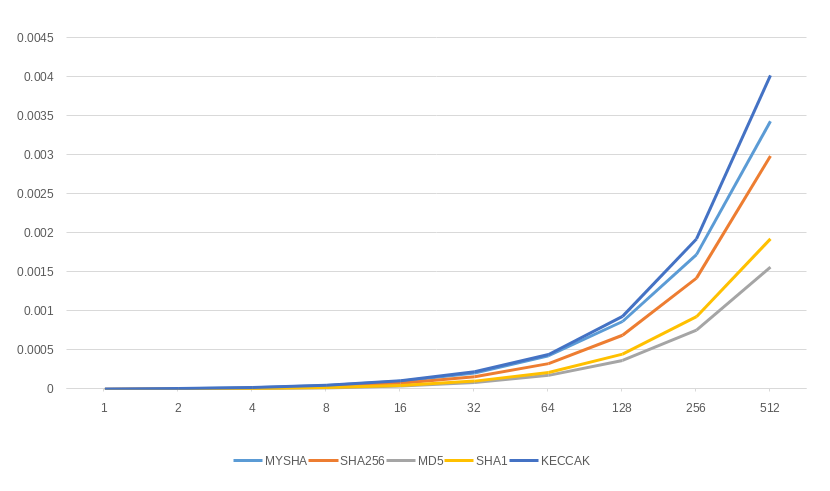

# Hash function

My attempt to implement hash function somewhat similar to sha-256.

## Project Setup

Clone the project

```zsh
git clone https://github.com/tmneth/hash-generator.git

# to automatically load submodules, you can use –recurse-submodules switch
git clone --recurse-submodules https://github.com/tmneth/hash-generator.git
```

Initialise and update submodules [to use existing hash functions](https://github.com/stbrumme/hash-library)

```
git submodule init
git submodule update
```

Compile the files

```
g++ src/*.cpp lib/hash-library/{sha256,md5,sha1,keccak}.cpp -o 'main' && ./main
```

## User Interface

Once compiled, user will be presented with the following options:

```
Please use one of the following flags:
-h, --help: Show this help message
-f, --file: Hash a file
-s, --string: Hash an input string
-t, --tests: Perform tests
--salt: Add salt to hash
```

Example:

```zsh
# hash a file
./main -f empty.txt

# hash a string
./main -s "hello world"

# load the tests
./main -t
```

*Note, for a salt to be used, it has to be passed as the first command line argument

```
./main --salt "something" -s "hello world"
```

## Hash Function

To understand how the algorithm works check out [step-by-step hash of “hello world”](example.md)

## Analysis

### Part 1 - Input & Output

For the test purposes 7 different text files were created.
Every single file was hashed twice, hexes were compared.

```
Hashing twice file: letter.txt; Word size: 64
Hash (1): c56ebd88c9afd0981201c4de665372aad244bbf8861f54743fecd1d484caff2c
Hash (2): c56ebd88c9afd0981201c4de665372aad244bbf8861f54743fecd1d484caff2c
Hashes are: identical

Hashing twice file: char.txt; Word size: 64
Hash (1): 509edaaa536b19e8c44a4bd484f27358f05f4c70fb51ce900a8f11388be4e8d4
Hash (2): 509edaaa536b19e8c44a4bd484f27358f05f4c70fb51ce900a8f11388be4e8d4
Hashes are: identical

Hashing twice file: rand_1000_1.txt; Word size: 64
Hash (1): be5414a42b887e3026f76784ab760408f4515fd4b14859b0774f0d588fb08098
Hash (2): be5414a42b887e3026f76784ab760408f4515fd4b14859b0774f0d588fb08098
Hashes are: identical

Hashing twice file: rand_1000_2.txt; Word size: 64
Hash (1): 6dae59dcf00227f01114ee783aa083e0c02ba9b0ae91d82033e42608e1d33678
Hash (2): 6dae59dcf00227f01114ee783aa083e0c02ba9b0ae91d82033e42608e1d33678
Hashes are: identical

Hashing twice file: sim_1500_1.txt; Word size: 64
Hash (1): 62610d2829307e5c2f051b700ad57dd85e5e2fe05297545434d52fb4e25b37d0
Hash (2): 62610d2829307e5c2f051b700ad57dd85e5e2fe05297545434d52fb4e25b37d0
Hashes are: identical

Hashing twice file: sim_1500_2.txt; Word size: 64
Hash (1): 5e31f454f557c94c268adbe892b049f0d20e2e98aa9892e44f348708e1292800
Hash (2): 5e31f454f557c94c268adbe892b049f0d20e2e98aa9892e44f348708e1292800
Hashes are: identical

Hashing twice file: empty.txt; Word size: 64
Hash (1): 0152fb74025769d049710ea4f8f46cbcb539d6b88fdd309866860174ecc54ea0
Hash (2): 0152fb74025769d049710ea4f8f46cbcb539d6b88fdd309866860174ecc54ea0
Hashes are: identical

Conclusion: hashing algorithm is deterministic.
```

### Part 2 - Time Complexity

To test execution time, it was measured how much time it takes for the function to hash 1,2,4,8...512 lines from file
konstitucija.txt - overall time grows linearly. (100 hashing rounds were performed & the
average time was calculated).

Time complexity of the hash function is O(n).

| Lines | 1          | 2          | 4          | 8          | 16         | 32          | 64          | 128         | 256         | 512        |
|-------|------------|------------|------------|------------|------------|-------------|-------------|-------------|-------------|------------|
| Time  | 0.000007s. | 0.000013s. | 0.000028s. | 0.000053s. | 0.000109s. | 0.000210s.  | 0.000432s. | 0.000862s.  | 0.001735s. | 0.003466s. |



### Part 3 - Collision Test

For this test, pairs of randomly generated strings were hashed and compared (25000 pairs of 10, 100, 500, 1000 character
long,
randomly generated strings).

`No collisions were found.`

### Part 4 - Avalanche Effect Test

After hashing, 25000 pairs of 10, 100, 500, 1000 character longs strings, that differ only by one character, following
results were achieved:

```
Avg difference (hex): 91.48%
Avg difference (bit): 32.43%
Min difference (hex): 73.44%
Min difference (bit): 22.66%
Max difference (hex): 100.00%
Max difference (bit): 42.97%
```

### Part 5 - Comparison with SHA256, MD5, SHA1, KECCAK

#### Avalanche Effect Test

Overall, MYSHA average difference hexwise and bitwise was the smallest compared to other algorithms.

|        | avg (hex) | avg (bit) | min (hex) | min (bit) | max (hex) | max (bit) |
|--------|-----------|-----------|-----------|-----------|-----------|-----------|
| MYSHA  | 91.48%    | 32.43%    | 73.44%    | 22.66%    | 100.00%   | 42.97%    |
| SHA256 | 93.74%    | 33.01%    | 76.56%    | 23.63%    | 100.00%   | 42.77%    |
| MD5    | 93.73%    | 33.01%    | 68.75%    | 19.53%    | 100.00%   | 45.70%    |
| SHA1   | 93.75%    | 33.01%    | 70.00%    | 21.25%    | 100.00%   | 44.06%    |
| KECCAK | 93.74%    | 33.01%    | 76.56%    | 23.83%    | 100.00%   | 43.36%    |

#### Time Complexity

To test execution time, it was measured how much time it takes for every function to hash 1,2,4,8...512 lines from file
konstitucija.txt. (100 hashing rounds were performed & the
average time was calculated). Overall, MYSHA performed as the second-slowest function in this test, being only faster
than
KECCAK. Meanwhile, MD5 and SHA1 were the fastest ones.



### Part 6 - Hiding and Puzzle-Friendliness

To reduce chances of guessing the input, unique salt can be added to each string before its hashing.
To test how salt mutates output, previously used 7 files were hashed with and without adding salt, which was randomly
generated. As you can see, salt
drastically changes the output.

```
Hashing twice file: letter.txt; Word size: 64
Hash (original): c56ebd88c9afd0981201c4de665372aad244bbf8861f54743fecd1d484caff2c
Hash (salted):   0709daf4907a61dc777b043271c28b7c23543c80072da7040d479398e1a437ac

Hashing twice file: char.txt; Word size: 64
Hash (original): 509edaaa536b19e8c44a4bd484f27358f05f4c70fb51ce900a8f11388be4e8d4
Hash (salted):   ee128ec4ef719ad865329286e41ace2ecc2c0ca8b1cb68bcd423bbbc006251cc

Hashing twice file: rand_1000_1.txt; Word size: 64
Hash (original): be5414a42b887e3026f76784ab760408f4515fd4b14859b0774f0d588fb08098
Hash (salted):   390571101ba2db68b986f5308aab2c7c730bf9f0df54abe08f215dd400128e68

Hashing twice file: rand_1000_2.txt; Word size: 64
Hash (original): 6dae59dcf00227f01114ee783aa083e0c02ba9b0ae91d82033e42608e1d33678
Hash (salted):   3dae09f0cea1c65827cffcd4c45b7b5c2abf0018e466d9687ea53d284d0cd70c

Hashing twice file: sim_1500_1.txt; Word size: 64
Hash (original): 62610d2829307e5c2f051b700ad57dd85e5e2fe05297545434d52fb4e25b37d0
Hash (salted):   1a0ceeb8e03ef40834b9255c5936465c7316a290cb795c1c3dd70a0c0eda180c

Hashing twice file: sim_1500_2.txt; Word size: 64
Hash (original): 5e31f454f557c94c268adbe892b049f0d20e2e98aa9892e44f348708e1292800
Hash (salted):   9fba34903351715c04ef39546efeb5b4b932d888838fea0c6b71c11cf34653dc

Hashing twice file: empty.txt; Word size: 64
Hash (original): 0152fb74025769d049710ea4f8f46cbcb539d6b88fdd309866860174ecc54ea0
Hash (salted):   e4775a6c1d9bda18e5c8c454d2b71454df158320c5d0e9b4c5700870ec014824
```
